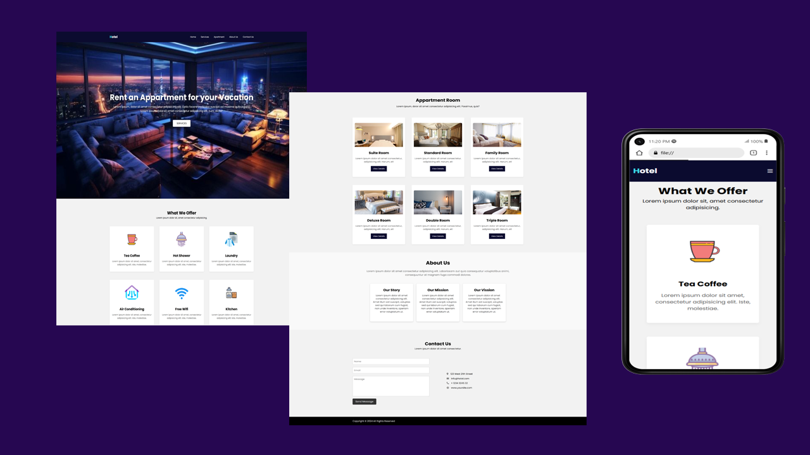

## Table of contents

- [Overview](#overview)
  - [Screenshot](#screenshot)
  - [Links](#links)
- [My process](#my-process)
  - [Built with](#built-with)
  - [What I learned](#what-i-learned)

## Overview
A modern, responsive hotel website built with HTML and CSS, designed to showcase apartment rental services with an elegant layout and user-friendly navigation. This website is ideal for hotels, resorts, or apartment businesses looking to establish a professional web presence.

### Screenshot

### Links

- Solution URL: [View Code](https://github.com/Ramelzkie96/visual-designer-portfolio.git)
- Live Site URL: [Live Site](https://virtual-designer.netlify.app/)

## My process

### Built with

This project was built entirely with static front-end technologies. I focused on clean structure and responsive design principles to ensure a visually appealing and user-friendly experience across devices. Each section of the site was planned and developed using semantic HTML and styled with modular, maintainable CSS. No frameworks or libraries were used for layout or functionality, keeping everything lightweight and fast.

- **strong** – for the structure and semantic markup
- **CSS3** – for styling and layout, including Flexbox and custom classes
- **Font Awesome** – for icons used throughout the interface

### What I learned

While building this Hotel Website using only hardcoded HTML and CSS, I gained a deeper understanding of:

1. **Responsive Design:** I learned how to use media queries to adjust layout and styling for different screen sizes, ensuring the website looks great on both desktop and mobile devices.
2. **CSS Flexbox and Grid:** I used Flexbox for aligning elements in the header and service cards, and Grid layout for organizing apartment listings. This helped me create clean, responsive layouts.
3. **CSS Transitions and Hover Effects:** I implemented smooth hover effects on cards and buttons to enhance user experience and interactivity.
4. **Fixed Headers and Smooth Scrolling:** I practiced making a fixed navigation bar and enabling smooth scroll behavior, improving the site’s usability.
5. **Box Shadows and Aesthetic Design:** I utilized shadows, padding, and border-radius to give components a soft, modern look.
6. **Code Organization:** I maintained a consistent naming convention and structured my CSS logically, which made the code easier to manage and update.
